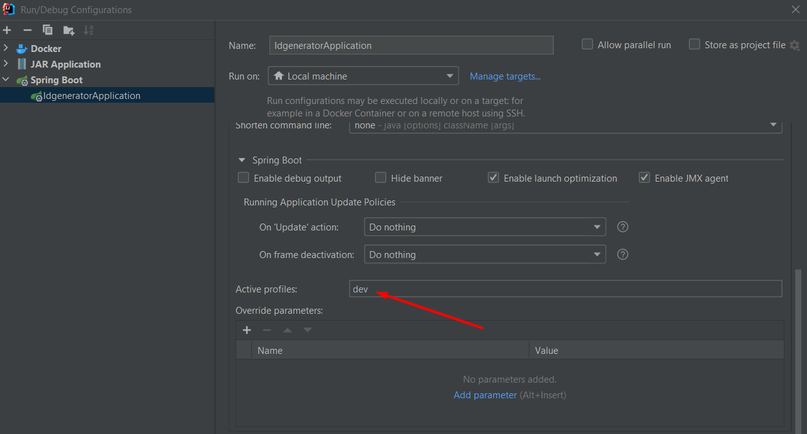
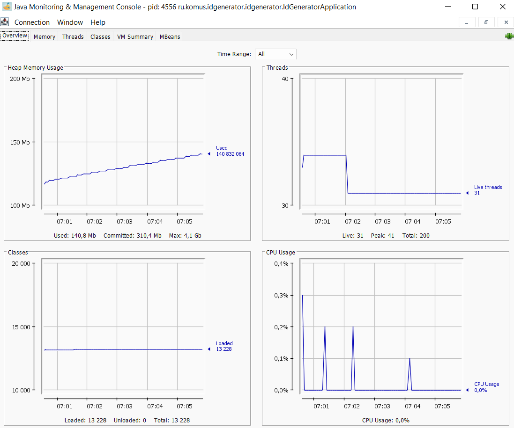

# Подсистема генерации идентификаторов

## Локальный запуск приложения 
Подсистема генерации идентификаторов — это приложение Spring Boot, созданное с использованием Maven.
При разработке была использована Java 11.
База данных - postgresql, для её установки вам необходимо:

скачать postgresql версии 14.1 https://www.postgresql.org/download/
и создать базу данных:
```
name=generator
port=5432
username=postgres
password=postgres
```

или запустить docker-compose файл в корне проекта, при этом настроить application-dev.properties
`spring.datasource.url=jdbc:postgresql://db:5433/generator`

Запуск приложение с командной строки:
`mvn spring-boot:run -Pdev -Dspring.profiles.active="dev"`

Затем вы можете получить доступ к приложению по адресу: http://localhost:8080/

## Работа с приложением в вашей IDE

В вашей системе должны быть установлены следующие компоненты:

- Java 11 или новее (полный JDK, а не JRE).
- инструмент командной строки git
- maven
- ваша среда разработки

### Шаги:

В командной строке выполнить

`git clone https://bitbucket-app.komus.net/scm/gen/idgenerator.git`

Внутри IntelliJ IDEA в главном меню выберите File -> Open и выберите файл pom.xml. Нажмите на кнопку Открыть.

Для работы с профилем dev зайдите в Run/Debug Configuration и поставьте в active profiles "dev"



## Мониторинг
В приложении настроена система мониторинга стандарта JMS,
вы можете использовать клиент JAVA_HOME/bin/jconsole.exe для отображения его работы.


